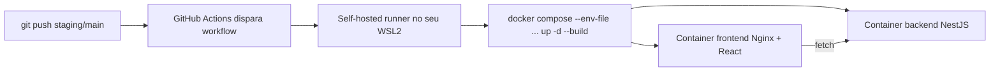

# CI/CD Estudo — NestJS + React/Vite + Docker + GitHub Actions

Projeto de estudo pra entender, na prática, como um push numa branch vira um deploy automático:
GitHub Actions com **self-hosted runner** rodando dentro do seu WSL2, construindo imagens Docker
via Dockerfile e subindo os containers via docker-compose.



## Pré-requisitos

- Windows com WSL2 instalado (`wsl --install` no PowerShell como admin, se ainda não tiver).
- Docker Desktop, com a opção **"Use the WSL 2 based engine"** e a integração ligada pra sua
  distro (Settings → Resources → WSL Integration).
- Git e Node 20+ dentro do WSL2 (pra rodar `npm install` fora do container quando quiser testar
  algo rápido sem build de imagem).
- O repositório clonado **dentro do filesystem do WSL2** (ex: `~/projetos/CiCd-Estudo`), não em
  `/mnt/c/...`. Rodar direto do `C:` funciona, mas o I/O fica bem mais lento e o Docker Desktop
  recomenda evitar.

## Primeira vez rodando local (sem CI ainda)

```bash
cp .env.example .env
docker compose up -d --build
```

Depois disso: backend em `http://localhost:3000`, frontend em `http://localhost:8080` (as portas
vêm do `.env`, ajuste se estiverem ocupadas). O frontend busca o hello-world do backend e mostra
na tela — se aparecer erro de fetch, confira se `VITE_API_URL` no `.env` bate com a porta do
backend e rebuilde o frontend (motivo explicado mais abaixo).

## Dockerfile vs docker-compose — a diferença que confunde no começo

O **Dockerfile** é a receita de **uma imagem só**: uma sequência de passos ("parte de uma imagem
Node, copia isso, roda `npm install`, roda o build") que termina num artefato — a imagem Docker.
Ele não sabe nada sobre rede, portas expostas pra fora, ou outros containers. Cada serviço deste
projeto (`backend/Dockerfile` e `frontend/Dockerfile`) tem o seu.

O **docker-compose.yml** é quem orquestra: pega uma ou mais imagens (construídas a partir dos
Dockerfiles ou baixadas prontas), diz quais portas do host mapeiam pra quais portas de cada
container, cria uma rede interna onde os containers se enxergam pelo nome do serviço
(`backend`, `frontend`), injeta variáveis de ambiente, e define ordem de inicialização
(`depends_on`). Sem o compose, você teria que digitar um `docker run` gigante e manual pra cada
serviço, e configurar a rede entre eles na mão.

Resumindo: Dockerfile = como construir uma imagem. Compose = como rodar várias imagens juntas.

## `up`, `up -d`, `down` — o que cada um realmente faz com seus dados

Essa é a dúvida mais comum e a resposta certa é: **por padrão, nada é apagado à toa**. O Compose
é idempotente — ele compara a definição atual (`docker-compose.yml` + `.env`) com o que já está
rodando, e só recria o que mudou.

- `docker compose up` — sobe os containers e **fica preso no terminal** mostrando os logs em
  tempo real. `Ctrl+C` para tudo.
- `docker compose up -d` — mesma coisa, mas "detached": sobe em background e devolve o controle
  do terminal. É o que os workflows de CI usam, porque um job de Actions não pode ficar "preso"
  esperando logs pra sempre.
- `docker compose up -d --build` — força reconstruir as imagens antes de subir (sem `--build`, se
  a imagem já existir com o mesmo hash de contexto, o Compose pode reaproveitar a antiga e não
  pegar suas mudanças de código).
- `docker compose down` — para e **remove** os containers e a rede criada. Isso não é "apertar
  pause", é destruir o container e recriar do zero na próxima subida. Mas atenção: **volumes
  nomeados não são removidos** por um `down` simples — dados de banco de dados guardados em
  volume sobrevivem.
- `docker compose down -v` — aí sim remove também os volumes nomeados. É o comando que realmente
  apaga dados persistentes (ex: banco zerado). Não tem `-v` nos workflows deste projeto de
  propósito — não queremos apagar dado nenhum a cada deploy.

Regra prática pra saber o que sobrevive a um redeploy:

- Código dentro da imagem (o `dist/` do Nest, os arquivos estáticos do Vite) — sempre descartado
  e reconstruído no `--build`, é pra isso mesmo que ele existe.
- Dados gravados num **volume nomeado** (esse projeto não tem nenhum ainda, mas é assim que
  Postgres/Mongo em Docker guardam dado) — sobrevivem a `down`/`up`, só morrem com `down -v` ou
  `docker volume rm`.
- Dados gravados **dentro do container sem volume** (ex: um arquivo criado em `/app/tmp` sem
  mapear volume nenhum) — morrem toda vez que o container é destruído, porque o filesystem do
  container é efêmero por natureza.

Os workflows deste repo usam `up -d --build` (nunca `down`), então cada deploy só reconstrói e
substitui o container antigo pelo novo — sem apagar nada que não seja o próprio container.

## `.env` dentro do Docker — as 3 camadas que se confundem

Isso aqui é o ponto que mais gera bug de "funciona local mas não no container". São três
mecanismos diferentes, todos chamados de ".env" ou "variável de ambiente", mas que agem em
momentos diferentes:

**1. `.env` na raiz, lido pelo `docker-compose.yml` (build/deploy-time do compose).**
Serve só pra substituir `${VARIAVEL}` dentro do próprio `docker-compose.yml` — coisas como qual
porta expor no host, qual `APP_ENV` usar no nome do container. Esse valor **não entra
automaticamente dentro do container**; ele só existe enquanto o Compose está montando a
configuração.

**2. `environment:` / `env_file:` no `docker-compose.yml` (runtime do container).**
Isso sim injeta variáveis **dentro do processo que roda no container**. É como o backend NestJS lê
`process.env.PORT` e `process.env.APP_ENV` em `main.ts` — o Node lê isso em tempo real, toda vez
que o processo inicia. Mudou o valor no `.env` e rodou `up -d` de novo (sem nem precisar
`--build`)? O container novo já sobe com o valor atualizado, porque isso é lido em runtime.

**3. `ARG` no `Dockerfile`, passado via `build.args` no compose (build-time da imagem).**
É o caso do frontend. O Vite não é um servidor rodando — depois do `npm run build`, o resultado é
HTML/JS/CSS estático, sem processo Node nenhum pra "ler" env em runtime. Por isso o
`VITE_API_URL` precisa estar disponível **no momento do build**, e o Vite literalmente escreve o
valor dentro do JavaScript compilado. Consequência prática: se você mudar `VITE_API_URL` no
`.env` e só rodar `up -d` sem `--build`, **nada muda** — a imagem antiga (com o valor antigo já
"assado" dentro do JS) continua sendo usada. Pra esse valor mudar de verdade, precisa
`--build`.

Regra de bolso: processo rodando dentro do container (backend Node, qualquer runtime de servidor)
= variável de runtime (`environment`/`env_file`), pode trocar sem rebuild. Artefato estático
gerado uma vez (frontend buildado) = `ARG`/build-time, precisa rebuild pra refletir mudança.

## Instalando e registrando o self-hosted runner

1. No GitHub, vá em **Settings → Actions → Runners → New self-hosted runner** no seu repositório
   `CiCd-Estudo`. Escolha Linux/x64 (porque vai rodar dentro do WSL2, não no Windows nativo).
2. O GitHub mostra um bloco de comandos com um token temporário. Copie e cole **dentro do
   terminal WSL2** (não no PowerShell) — é o mesmo WSL2 onde o Docker Desktop está integrado,
   porque o runner vai chamar `docker compose` que precisa enxergar o daemon do Docker.
3. Depois do `./config.sh`, ele pergunta o nome do runner, labels e a pasta de trabalho. Pode
   aceitar os padrões.
4. Em vez de rodar `./run.sh` manualmente toda vez, instale como serviço pra ele ficar sempre
   ativo e reiniciar sozinho com a máquina:
   ```bash
   sudo ./svc.sh install
   sudo ./svc.sh start
   ```
5. **Antes do primeiro push pras branches `staging`/`main`**, crie os arquivos de ambiente numa
   pasta **fora** do que o runner gerencia — isso importa, veja o porquê logo abaixo:
   ```bash
   mkdir -p ~/deploy-secrets/cicd-estudo
   cd ~/deploy-secrets/cicd-estudo
   cp /caminho/do/repo/.env.staging.example .env.staging       # edite os valores se precisar
   cp /caminho/do/repo/.env.production.example .env.production
   ```

   **Por que fora, e não dentro de `_work/CiCd-Estudo/CiCd-Estudo/`:** o `actions/checkout`
   roda `git clean -ffdx` antes de baixar o código a cada execução — isso apaga todo arquivo não
   rastreado pelo git da pasta de trabalho, **inclusive os que estão no `.gitignore`**. Se você
   colocar o `.env.staging` direto ali, ele desaparece no próximo push. Por isso os workflows têm
   um step que copia de `~/deploy-secrets/cicd-estudo/` pra dentro da pasta de trabalho **depois**
   do checkout, toda vez — a fonte de verdade nunca fica num lugar que o Git possa limpar.

## Testando o fluxo staging → main

```bash
git checkout -b staging
git push -u origin staging
```

Abra a aba **Actions** no GitHub e acompanhe o job `Deploy Staging` rodando na sua própria
máquina. Depois de verde, confira `http://localhost:8081` (porta do `.env.staging.example`).
Repita pra `main` (porta `8082`) quando estiver confiante.

## Cheat sheet do dia a dia

```bash
docker compose ps                    # o que está rodando
docker compose logs -f backend       # logs em tempo real de um serviço
docker compose --env-file .env.staging -p cicd-estudo-staging ps
docker compose down                  # para e remove containers (mantém volumes)
docker system df                     # quanto espaço em disco o Docker está usando
```

## Notas de segurança

Um self-hosted runner executa **qualquer código que estiver no workflow de qualquer push
aceito no repo** com os privilégios do usuário que roda o runner na sua máquina. Em repositório
público isso é perigoso (PR malicioso de fora poderia rodar comando arbitrário no seu WSL) — para
estudo com repo privado e só você com push access, o risco é baixo, mas vale internalizar a regra
antes de aplicar isso numa empresa: self-hosted runner = confiar plenamente em quem pode dar
push. Nunca commite `.env`, `.env.staging` ou `.env.production` — todos estão no `.gitignore`.
